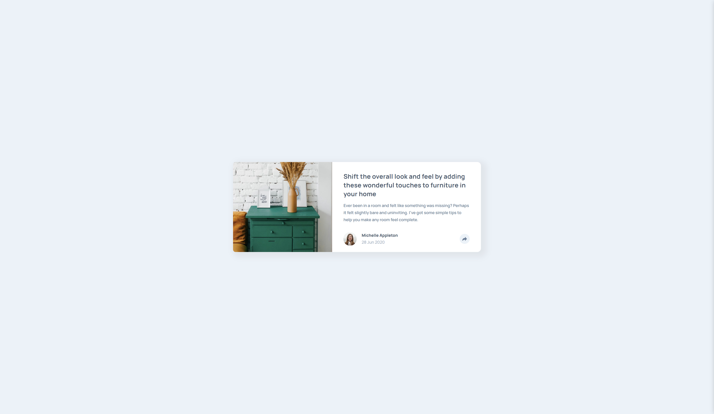

# Frontend Mentor - Article preview component solution

This is a solution to the [Article preview component challenge on Frontend Mentor](https://www.frontendmentor.io/challenges/article-preview-component-dYBN_pYFT). Frontend Mentor challenges help you improve your coding skills by building realistic projects. 

## Table of contents

- [Overview](#overview)
  - [The challenge](#the-challenge)
  - [Screenshot](#screenshot)
  - [Links](#links)
- [My process](#my-process)
  - [Built with](#built-with)
  - [What I learned](#what-i-learned)
  - [Continued development](#continued-development)
  - [Useful resources](#useful-resources)
- [Author](#author)

## Overview

### The challenge

Users should be able to:

- View the optimal layout for the component depending on their device's screen size
- See the social media share links when they click the share icon

### Screenshot

### Links

- [Solution](https://github.com/antoniomontoia/article-preview-component-master)
- [Live Site](https://antoniomontoia.github.io/article-preview-component-master)

## My process

### Built with

- Semantic HTML5 markup
- CSS custom properties
- Flexbox
- CSS Grid
- Mobile-first workflow
-  JavaScript

### What I learned

In this project, I took my first steps into JavaScript, which was quite a challenge but ultimately rewarding. I successfully implemented Flexbox and CSS Grid for layout design, allowing me to create a responsive web page that adapts to different screen sizes.

One of the key learnings was figuring out how to dynamically show and hide containers based on user actions. This involved understanding event handling and manipulating CSS properties, which was a significant milestone for me. I also learned how to create overlays to display additional information without navigating away, enhancing the overall user experience.

Throughout the process, I developed my problem-solving skills by troubleshooting various challenges, such as toggling visibility and ensuring elements displayed correctly. I gained insights into user experience design, focusing on intuitive interactions and smooth application flow.

### Continued development

In future projects, I’d like to deepen my understanding of working with the DOM. While I’ve made progress, I want to explore the vast array of functions available and how to use them effectively to manipulate elements and enhance interactivity.

### Useful resources

- [Chat Bubble CSS](https://codepen.io/rikschennink/pen/mjywQb) - This helped me designing the overlay for I had no idea how to attach a triangle to the main shape.

## Author

- Frontend Mentor - [@antoniomontoia](https://www.frontendmentor.io/profile/antoniomontoia)
- Dribbble - [@franissimo](https://www.dribbble.com/franissimo)